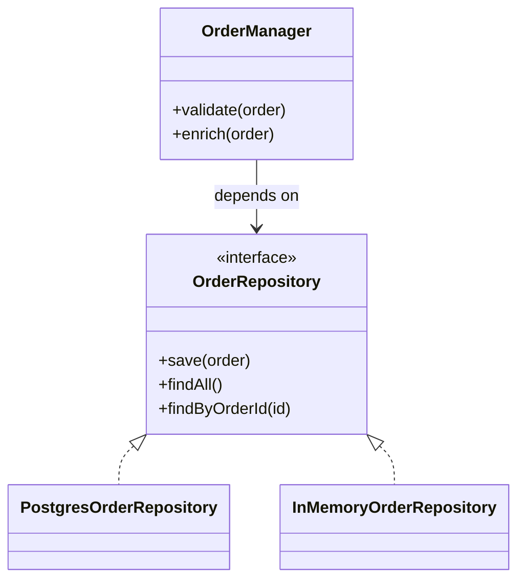
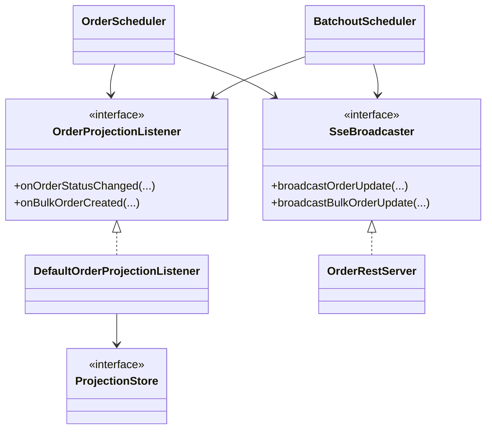

# Project 3 Technical Report (Code-Grounded)

Project summary: MF-OMS is a mutual fund order management system with role-based web clients (admin OMS and investor/advisor UI), a Java backend, event-driven processing via Kafka, read-model projection (CQRS), and real-time updates via SSE.

Primary stack (from code):
- Backend: Java 11, com.sun.net.httpserver, Maven
- Datastores: PostgreSQL (write-side), MongoDB (optional read-model), Redis (idempotency/session/locks)
- Messaging: Kafka
- Frontends: React + Vite (`frontend/`, `user-frontend/`)
- Runtime topology: Docker Compose + Nginx reverse proxy/load balancing

---

## Task 1: Requirements and Subsystems

## 1.1 Functional Requirements (Observed in Code)

| Functional Requirement | Evidence in Code | Why It Exists in Implementation |
|---|---|---|
| Plan one or many orders | `POST /orders/plan` in `src/main/java/com/iiit/oms/interfaces/OrderRestServer.java` (`PlanOrdersHandler`) | Parses list payload, assigns IDs, persists, projects, emits SSE |
| Cancel order before terminal lifecycle stages | `POST /orders/cancel` (`CancelOrderHandler`) + `OrderStateMachine.cancel(...)` in `src/main/java/com/iiit/oms/processor/OrderStateMachine.java` | Enforces state-safe cancel behavior |
| Confirm bulked/transmitted orders | `POST /orders/confirm` (`ConfirmOrdersHandler`) | Admin lifecycle transition control |
| Book confirmed orders | `POST /orders/book` (`BookOrdersHandler`) | Moves confirmed orders to booked state |
| Query orders and status | `GET /orders`, `GET /orders/status` (`ListOrdersHandler`, `OrderStatusHandler`) | Operational visibility |
| Query projected views | `/view/orders`, `/view/bulk-orders`, `/view/dashboard` handlers in `OrderRestServer` | Read-side optimized UI endpoints |
| Fund listing and NAV update | `GET /funds`, `POST /funds/nav` (`ListFundsHandler`, `UpdateNavHandler`) | Product catalog and NAV administration |
| Account-level transaction ledger | `GET /view/transactions` (`TransactionsHandler`) | Historical account transaction visibility |
| Portfolio view | `GET /view/portfolio` (`PortfolioHandler`) | Investor position/P-L surfaces |
| Reconciliation workflow | `GET /view/reconciliation`, `POST /view/reconciliation/resolve` | Break management between expected and TA callback values |
| Transfer agent callback simulation | `POST /transfer-agent/contract`, `POST /transfer-agent/eod` | Contracting/booking lifecycle integration |
| Advisor workflows | `/advisor/me`, `/advisor/clients`, `/advisor/orders`, `/advisor/orders/plan`, `/advisor/dashboard` | Advisor mode for client management |
| Authentication and session endpoints | `/auth/login`, `/auth/me`, `/auth/logout` | Token-based authenticated sessions |
| Real-time notifications | `GET /view/stream` (`ViewStreamHandler`), frontend `useSse` hooks | Push updates for order/bulk/NAV/replay events |
| Audit access | `/orders/audit`, `/view/audit-archive` | Compliance and traceability |
| SLA telemetry endpoint | `GET /view/sla` (`SlaHandler`) | Operational latency/deadline tracking |

### Architecturally Significant Functional Requirements

1. Real-time portfolio/order synchronization
- Evidence: SSE stream in `ViewStreamHandler`, publish helpers in `OrderRestServer` (`publishViewEvent`, `broadcastOrderUpdate`, `broadcastBulkOrderUpdate`), and SSE hooks in `frontend/src/hooks/useSse.js` and `user-frontend/src/hooks/useSse.js`.
- Significance: Drives event-driven architecture and cross-replica consistency needs.

2. End-to-end order lifecycle automation
- Evidence: `OrderStateMachine`, `OrderScheduler`, `BatchoutScheduler`, transfer-agent callbacks in `OrderRestServer`.
- Significance: Core business flow with strict status transitions and state-dependent operations.

3. Reconciliation break handling
- Evidence: `ViewReconciliationHandler`, `ResolveReconciliationHandler`, escalation scheduler in `OmsApplication` (`findUnresolvedOlderThan(3600)`).
- Significance: Risk/compliance-critical post-trade control.

4. Multi-role access control
- Evidence: `RbacFilter` access map + `JwtService` token validation.
- Significance: Security boundary across admin/investor/advisor capabilities.

## 1.2 Non-Functional Requirements (Inferred from Code)

| NFR | Evidence | Notes |
|---|---|---|
| Security (authN/authZ) | `JwtService`, `RbacFilter`, protected frontend routes (`ProtectedRoute`) | HMAC JWT, revocation store, role-based endpoint matrix |
| Availability and horizontal scaling | `docker-compose.yml` has `app_1`, `app_2`; `nginx.conf` upstream `least_conn` | Two backend replicas with load balancing |
| Performance observability | `LatencyFilter`, `SlaHandler` (`p99Ms`, `avgMs`, request counts) | Runtime latency telemetry endpoint |
| Consistency for read-heavy UI | CQRS projection (`ProjectionStore`, `MongoDbProjectionStore`, `InMemoryProjectionStore`) | Isolates query model from write model |
| Idempotency and duplicate suppression | `IdempotencyStore` usage in `PlanOrdersHandler`, Redis dedup in `BatchoutScheduler` | Reduces duplicate-order and duplicate-transmission risks |
| Fault tolerance / graceful degradation | Redis/Kafka fallback logic in `OmsApplication` | In-memory fallbacks keep app running in degraded mode |
| Maintainability | package-layered structure (`interfaces`, `processor`, `repository`, `db`, `readmodel`) | Clear responsibility boundaries |

## 1.3 Subsystem Overview

| Subsystem | Main Paths | Responsibility |
|---|---|---|
| HTTP/API layer | `src/main/java/com/iiit/oms/interfaces/OrderRestServer.java` | Route registration, handlers, serialization, SSE endpoint |
| Security/auth | `src/main/java/com/iiit/oms/auth/`, `src/main/java/com/iiit/oms/filter/RbacFilter.java` | JWT issue/validation, revocation, RBAC authorization |
| Core business processing | `src/main/java/com/iiit/oms/processor/` | Validation, enrichment, state transitions, scheduling, batching |
| Write-side persistence | `src/main/java/com/iiit/oms/repository/`, `src/main/java/com/iiit/oms/db/postgres/` | Domain repositories over PostgreSQL databases |
| Read-side projection (CQRS) | `src/main/java/com/iiit/oms/readmodel/` and `.../impl/` | Denormalized read views for dashboard/orders/bulk queries |
| Messaging/event integration | `src/main/java/com/iiit/oms/kafka/` | Publish order/bulk/nav events, consume for processing and SSE bridge |
| Transfer agent integration | `src/main/java/com/iiit/oms/transfer/` | TA routing and transmission acknowledgments |
| Admin frontend | `frontend/src/` | OMS operations UI (dashboard, orders, funds, users, reconciliation) |
| Investor/advisor frontend | `user-frontend/src/` | Investor self-service + advisor mode workflows |
| Deployment and operations | `docker-compose.yml`, `nginx.conf`, `Makefile`, `scripts/` | Multi-service runtime, proxying, local/dev automation |

---

## Task 2: Architecture Framework (IEEE 42010)

## 2.1 Stakeholders, Concerns, and Views

| Stakeholder | Key Concerns | Architectural Viewpoint/View |
|---|---|---|
| Operations/Admin users | Correct lifecycle transitions, reconciliation control, auditability | Runtime/process view (`OrderScheduler`, `BatchoutScheduler`, reconciliation handlers), UI route view (`frontend/src/App.jsx`) |
| Investors | Correct portfolio/orders, responsive updates, safe order entry | UX + information view (`user-frontend/src/pages/*`, `/view/portfolio`, `/view/orders`) |
| Advisors | Multi-client visibility and batch planning | Advisor route/API view (`/advisor/*`, advisor pages in `user-frontend/src/pages/Advisor*`) |
| Backend developers | Evolvable codebase, testability, separations of concern | Module decomposition view (packages: `interfaces`, `processor`, `repository`, `readmodel`) |
| SRE/DevOps | Deployability, scaling, health, telemetry | Deployment view (`docker-compose.yml`, `nginx.conf`), ops endpoint view (`/view/sla`) |
| Compliance/Audit stakeholders | Immutable traces, post-facto analysis | Audit and archive view (`/orders/audit`, `/view/audit-archive`, `AuditLogArchiver`) |

## 2.2 ADRs (Nygard Template)

# ADR-1: CQRS Read Model with Pluggable Projection Store
## Status
Accepted and implemented.

## Context
Order lifecycle updates are write-intensive and status-rich; UI pages need fast aggregate and list queries (`/view/orders`, `/view/bulk-orders`, `/view/dashboard`).

## Decision
Use a projection listener (`OrderProjectionListener`) and a dedicated read model (`ProjectionStore`) with implementations `InMemoryProjectionStore` and `MongoDbProjectionStore` selected by `OMS_CQRS_USE_MONGO` in `OmsApplication.createProjectionStore()`.

## Consequences
- Faster read endpoints and simpler UI queries.
- Eventual consistency between write and read sides.
- Additional projection synchronization complexity.

# ADR-2: Event-Driven Integration via Kafka + SSE Bridge
## Status
Accepted and implemented.

## Context
Order and NAV updates must fan out to connected clients and across replicas.

## Decision
Publish state changes to Kafka in `KafkaOrderEventPublisher`; consume with `KafkaNotificationConsumer` (unique group per JVM) and rebroadcast through `SseBroadcaster` to local SSE clients.

## Consequences
- Better decoupling and cross-replica propagation.
- Added operational dependency on Kafka.
- Requires careful topic/subscription/event-type handling.

# ADR-3: Role-Based Access + JWT Revocation
## Status
Accepted and implemented.

## Context
System supports ADMIN, INVESTOR, ADVISOR with different endpoint permissions.

## Decision
Use JWT tokens (`JwtService`) with revocation store and `RbacFilter` access matrix (`ACCESS_MAP`) enforced at HTTP filter level.

## Consequences
- Uniform centralized authorization checks.
- Requires secure secret management (`OMS_JWT_SECRET`) and session/revocation store availability.

# ADR-4: Dual Replica Deployment Behind Nginx
## Status
Accepted and implemented.

## Context
Single backend instance is a scalability/availability bottleneck.

## Decision
Deploy `app_1` and `app_2` from same image via `docker-compose.yml`, fronted by `nginx.conf` upstream with `least_conn` load balancing and SSE-specific proxy tuning (`proxy_buffering off` on `/view/stream`).

## Consequences
- Improved availability and load spread.
- Requires distributed locking/idempotency to avoid duplicate scheduler work.
- SSE event propagation requires cross-replica event bridge (handled via Kafka consumer design).

---

## Task 3: Architectural Tactics and Patterns

## 3.1 Architectural Tactics (Observed)

1. Input validation and fail-fast domain checks
- Evidence: `OrderManager.validate(...)` verifies account/fund existence, amount positivity, BUY cash sufficiency, SELL capacity.
- NFR addressed: Reliability and data integrity.

2. Idempotency keys and dedup safeguards
- Evidence: `PlanOrdersHandler` reads `X-Idempotency-Key` and uses `IdempotencyStore.registerIfAbsent(...)`; `BatchoutScheduler` uses Redis key `oms:bulk:transmitted:<bulkId>` with `setnx`.
- NFR addressed: Correctness under retries and network duplicates.

3. Distributed lock for scheduled workers
- Evidence: `OrderScheduler` (`LOCK_KEY=oms:scheduler:order-lock`) and `BatchoutScheduler` (`BATCHOUT_LOCK_KEY`) use `DistributedLock` with Redis-backed coordination.
- NFR addressed: Horizontal scalability and duplicate-work prevention.

4. Real-time push with resilient reconnect
- Evidence: SSE endpoint `ViewStreamHandler`; frontend hooks implement exponential backoff reconnect up to 30s (`retryDelay`).
- NFR addressed: Freshness and operational resilience.

5. Runtime latency telemetry + SLO visibility
- Evidence: `LatencyFilter` ring buffer for p99 and averages; `SlaHandler` exposes `latency` object (`p99Ms`, `avgMs`, `totalRequests`) and cutoff countdowns.
- NFR addressed: Performance observability and operability.

## 3.2 Design Patterns

### Pattern A: Repository Pattern

Role in architecture:
- Business logic works against interfaces (`OrderRepository`, `FundRepository`, `AccountRepository`, etc.) while concrete implementations vary (`.../postgres/...`, `.../inmemory/...`).
- This isolates persistence concerns from orchestration logic in `OrderManager`, `OrderScheduler`, and handlers.

Evidence:
- Interfaces in `src/main/java/com/iiit/oms/repository/`
- Implementations in `src/main/java/com/iiit/oms/repository/postgres/` and `src/main/java/com/iiit/oms/repository/inmemory/`
- Wiring in `OmsApplication`

### Pattern B: Observer Pattern (Event Listener + SSE Subscribers)

Role in architecture:
- Write-side lifecycle changes notify projection and client channels without tight coupling.
- `OrderProjectionListener` reacts to order/bulk events; `SseBroadcaster` emits stream events to subscribed clients.

Evidence:
- `OrderProjectionListener` + `DefaultOrderProjectionListener`
- `OrderRestServer.publishViewEvent(...)`
- Frontend listeners in `useSse` hooks

---

## Task 4: Prototype Implementation and Analysis

## 4.1 Prototype End-to-End Feature (Non-trivial)

Feature chosen: Investor/admin order flow from planning to booking with real-time UI updates and reconciliation controls.

Trace through code:

1. Entry point (plan request)
- API: `POST /orders/plan` in `PlanOrdersHandler`.
- Behavior: parses array payload, sets defaults/IDs, applies idempotency checks, persists orders, publishes initial read-model update and SSE event.

2. Validation and enrichment
- `OrderScheduler.pollAndProcessPendingOrders()` scans unprocessed orders.
- `OrderStateMachine.process()` advances `PLANNED -> VALIDATED -> ENRICHED -> PLACED`.
- `OrderManager.validate(...)` enforces cash/holdings constraints; `enrich(...)` adds trade/settlement dates and NAV-derived quantity.

3. Batching and transmission
- `BatchoutScheduler.batchoutPlacedOrders()` groups by `(productID, side)`, creates bulk orders, maps constituent IDs, transitions orders to `BULKED` then `TRANSMITTED` after TA ack.
- Optional Redis dedup prevents duplicate transmission (`setnx` key per bulk order).

4. Contract callback and booking
- `ContractCallbackHandler` updates contracted details.
- `BookOrdersHandler` and EOD flow complete `BOOKED` transitions.

5. Read model and UI propagation
- `DefaultOrderProjectionListener` updates projection store (`projectOrder`, `updateOrderView`, etc.).
- `OrderRestServer` emits SSE (`order-updated`, `bulk-order-updated`, `nav-updated`, `replay-completed`).
- Frontend hooks receive events and trigger reloads on admin/user pages.

6. Reconciliation (risk control path)
- `/view/reconciliation` surfaces breaks; `/view/reconciliation/resolve` supports Accept/Retransmit/Cancel operational resolution.

## 4.2 Architecture Style and Comparison

Implemented style:
- Layered modular monolith with event-driven internals.
- Layers are explicit: interface -> processor -> repository/db, with side channels (Kafka, SSE) and read-model projection (CQRS-like split).

Compared alternative: full microservices decomposition
- Alternative would split auth/order/bulk/reconciliation/projection into independent deployables.
- Current design advantages: lower operational overhead, easier local development, fewer distributed transaction boundaries.
- Current design trade-off: one codebase/process image can grow in complexity; stricter module discipline is required.

## 4.3 Quantified NFRs

NFR-1: API latency observability
- Instrumentation exists in `LatencyFilter` and is exposed via `/view/sla` (`SlaHandler`) as:
  - `latency.p99Ms`
  - `latency.avgMs`
  - `latency.totalRequests`
- Measurement method:
  1. Generate realistic traffic (for example script `scripts/submit-100-orders-new.sh`).
  2. Poll `/view/sla` to capture p99/avg under load.
  3. Compare with and without dual-replica deployment.

NFR-2: Throughput and batch efficiency
- Structural indicators in code:
  - `OrderScheduler` poll interval: 30s.
  - `BatchoutScheduler` interval: 120s.
  - Bulk grouping by fund+side reduces transfer-agent calls from O(n orders) to O(k groups).
- Measurement method:
  1. Submit 100 orders using `scripts/submit-100-orders-new.sh`.
  2. Track transition completion counts in `/view/orders` and `/view/bulk-orders` over time.
  3. Compute effective orders/min and bulk orders/min.

## 4.4 Trade-offs

- CQRS projection:
  - Pro: fast query endpoints and UI simplification.
  - Con: eventual consistency and projection synchronization complexity.

- Kafka + SSE bridge:
  - Pro: near-real-time cross-replica updates.
  - Con: added messaging complexity and dependency management.

- Redis-backed reliability features:
  - Pro: idempotency, lock coordination, dedup safety.
  - Con: fallback behavior and consistency semantics must be carefully understood when Redis is unavailable.

---

## Individual Contributions (from Git history summary)

Based on `git shortlog -sne --all` in this repository:
- SRINIVAS CHITTA: 11 commits
- Shreyas-Mehta-05: 9 commits
- swamsingla1: 4 commits
- shubhamZXCV: 3 commits
- Srinivas Chitta (alternate identity/email): 2 commits
- saksham-chitkara: 1 commit

Note: At least one contributor appears under two identities (name/email variation).

---

## GitHub Repository

Repository: <your-github-link>

---

## Appendix: File Evidence Index (Non-exhaustive)

Backend core:
- `src/main/java/com/iiit/oms/OmsApplication.java`
- `src/main/java/com/iiit/oms/interfaces/OrderRestServer.java`
- `src/main/java/com/iiit/oms/processor/OrderManager.java`
- `src/main/java/com/iiit/oms/processor/OrderStateMachine.java`
- `src/main/java/com/iiit/oms/processor/OrderScheduler.java`
- `src/main/java/com/iiit/oms/processor/BatchoutScheduler.java`
- `src/main/java/com/iiit/oms/filter/RbacFilter.java`
- `src/main/java/com/iiit/oms/filter/LatencyFilter.java`
- `src/main/java/com/iiit/oms/auth/JwtService.java`
- `src/main/java/com/iiit/oms/readmodel/ProjectionStore.java`
- `src/main/java/com/iiit/oms/readmodel/impl/DefaultOrderProjectionListener.java`
- `src/main/java/com/iiit/oms/readmodel/impl/InMemoryProjectionStore.java`
- `src/main/java/com/iiit/oms/readmodel/impl/MongoDbProjectionStore.java`
- `src/main/java/com/iiit/oms/kafka/KafkaOrderEventPublisher.java`
- `src/main/java/com/iiit/oms/kafka/KafkaNotificationConsumer.java`

Frontend:
- `frontend/src/App.jsx`
- `frontend/src/hooks/useSse.js`
- `user-frontend/src/App.jsx`
- `user-frontend/src/hooks/useSse.js`

Deployment/ops:
- `docker-compose.yml`
- `nginx.conf`
- `Makefile`
- `scripts/submit-100-orders-new.sh`
